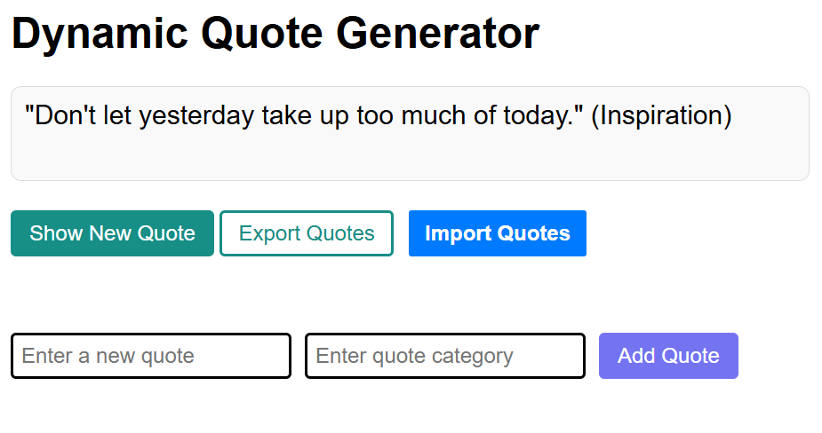

# Dynamic Quotes Generator

This project demonstrates core front-end concepts including **DOM manipulation**, **Web Storage**, and **working with JSON data**. The application is a dynamic quotes generator that allows users to view, save, and manage inspirational quotes.

---

## 📚 Table of Contents

- [Demo](#demo)
- [Features](#features)
- [Tech Stack](#tech-stack)
- [How It Works](#how-it-works)
- [Key Concepts Demonstrated](#key-concepts-demonstrated)
- [Getting Started](#getting-started)
- [Project Structure](#project-structure)
- [License](#license)
- [Credits](#credits)
- [Contact](#contact)

---

## Demo




---

## Features

- **Display Random Quotes:** Fetches and displays random quotes from a JSON data source.
- **DOM Manipulation:** Dynamically updates the UI based on user interactions (e.g., displaying new quotes, updating saved quotes).
- **Web Storage Integration:** Uses `localStorage` to persist user-saved quotes across sessions.
- **JSON Data Handling:** Loads quotes from a JSON file or API, parses them, and renders them in the browser.

---

## Tech Stack


-App%20Logic%2C%20DOM%20%26%20Storage-yellow?logo=javascript&logoColor=white>)


---

## How It Works

1. **Loading Quotes:** On page load, the app fetches a list of quotes from a JSON file or endpoint.
2. **Displaying Quotes:** A random quote is selected and displayed in the UI.
3. **Saving Quotes:** Users can save their favorite quotes. Saved quotes are stored in `localStorage`.
4. **Viewing Saved Quotes:** Users can view and manage their saved quotes, which persist even after refreshing or closing the browser.

---

## Key Concepts Demonstrated

- **DOM Manipulation:** Adding, removing, and updating elements in response to user actions.
- **Event Handling:** Listening for button clicks and other user events.
- **Web Storage:** Using `localStorage` to persist data.
- **JSON Parsing:** Loading and parsing JSON data for use in the application.

---

## Getting Started

1. Clone the repository.
2. Open `index.html` in your browser.
3. Interact with the quotes generator: view, save, and manage quotes.

---

## Example JSON Structure

```json
[
  {
    "    text": "The best way to get started is to quit talking and begin doing.",
    "    category": "Motivation"
  },
  {
    "text": "Don't let yesterday take up too much of today.",
    "category": "Inspiration"
  },
  {
    "text": "It's not whether you get knocked down, it's whether you get up.",
    "category": "Resilience"
  }
]
```

---

## Project Structure

```
dom-manipulation/
├── index.html
├── style.css
├── script.js
└── README.md
```

---

## License

This project is open-source and available under the MIT License.

---

## Credits

- Project idea & structure inspired by [ALX](https://www.alxafrica.com/) exercises
- Icons and badges from [Shields.io](https://shields.io/)

---

## Contact

Made with ❤️ by **Mia Mudzingwa**

- GitHub: [Mia06-coder](https://github.com/Mia06-coder)
- LinkedIn: [mia-mudzingwa](https://www.linkedin.com/in/mia-mudzingwa)
